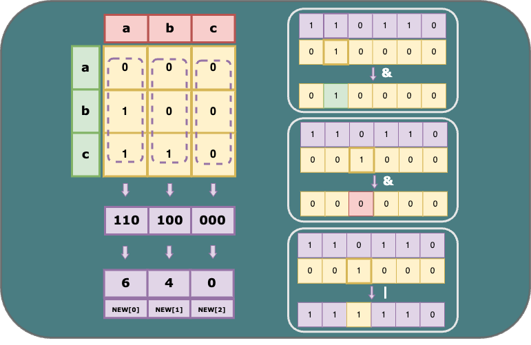

# Optimise Tideman Algorithm Using Bitwise Operations
This repo documents the solution applying bitwise operations into the application of the adjacency matrix in the Tideman voting algorithm, which achieves O(n) and Ω(1) for finding the winners. Importantly, it also condenses the processes of locking pairs and finding winners into a concise 10 lines of code while optimising memory usage to only 4/n of the adjacency matrix.

## 1.1 Definition of Tideman Algorithm

The Tideman (aka Ranked Pairs) algorithm is an electoral method where voters can vote for more than one candidate in order of preference. A "Condorcet winner," the person who would have won any head-to-head matchup against another candidate, will be elected from a sorted list of winners in such a system.

## 1.2 Procedure of Tideman Algorithm

The Tideman voting method operates as follows:

- **Tally:** Document the winner of each pair of candidates and the margin.
- **Sort:** Rank each pair by the strength of victory (margin) from largest first to smallest last.
- **Lock:** Starting with the strongest pair, go through the sorted pairs and "lock" the pairs that do not create a cycle with the existing locked-in pairs.
- **Find:** The winner in such a voting system is defined as a person who never appears as a loser in each head-to-head matchup.

## 1.3 Main Function Walkthrough

- `vote`: This function collects ballots from voters and ensures their validity by verifying if the names appear in the candidate list.
- `record_preferences`: This function generates pairs of winners and losers and counts the occurrences of each pair.
- `add_pairs`: This function adds all pairs with more votes (which means one candidate is preferred over the other among all voters).
- `sort_pairs`: This function sorts the pairs of candidates in decreasing order based on the strength of victory.
- `lock_pairs`: This function creates the locked graph by adding all pairs in decreasing order of victory strength while ensuring that each edge does not create a cycle. In this part, three methods, namely adjacency list, adjacency matrix, and bitwise operations are discussed for implementing the `lock_pairs` function.
- `print_winner`: This function will print out the names of the candidates who are the winners under the Tideman algorithm. The winners should be the “source” of the graph, meaning that no arrows point to them.

Notably, it only takes 10 lines of code in total using bitwise operations to lock pairs and print the winners with O(n) and Ω(1).

**Note:**

- As all alternative methods are included in the code, to try the code, please comment out the duplicated part, leaving only `a.1/a.2/a.3 + b` or `c` parts for locking pairs and finding winners.

- For more context about Tideman, please check the [CS50 problemset page](https://cs50.harvard.edu/x/2024/psets/3/tideman/). The article ["Optimize Tideman Algorithm Using Bitwise Operations"](https://anhui-gui.com/posts/bitwise-operators/) on [my website](https://anhui-gui.com/) has demonstrated detailed explanations of this solution with explicit illustrations.
